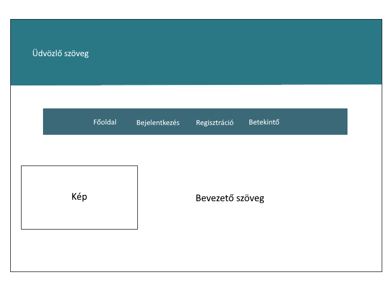
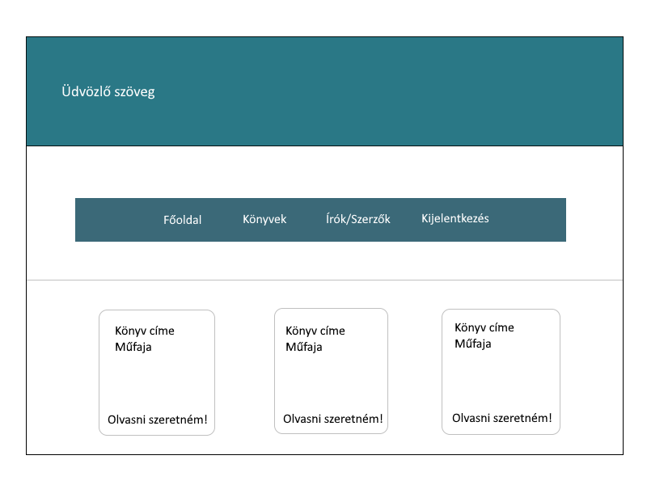
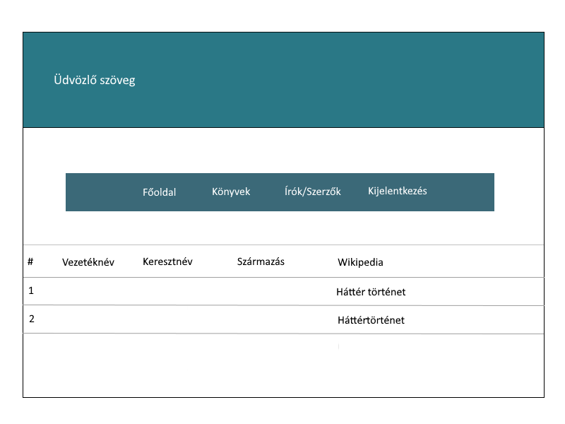
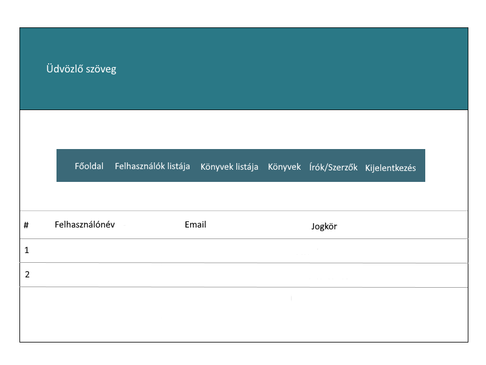
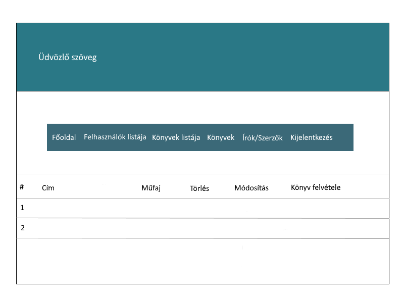

## 1. Áttekintés

A rendszer célja egy Webes felülettel rendelkező elektronikus könyvtár létrehozása. Ezen felületen összegyűjtjük a könyvekhez vezető forrásokat a könnyebb elérés és kezelés érdekében.
Ezután az eltárolt könyveket jelenítjük meg a weblapon biztosítva különbőző szűrési feltételeket a könnyebb keresés érdekében. A felhasználóknak lehetőségük lesz értékelni a könyveket, vagy éppen véleményt tudnak kifejteni az adott könyvről.
Továbbá lehetőséget biztosítunk egyes írók élettörténetéhez vezető források elérését azért, hogy a felhalsználók megismerjék kedvenc könyveik íróját vagy csak szimplán tudásuk bővítése érdekében. Ezen funkciókat valamint az összegyűjtött könyveket nem szeretnénk mindenki számára elérhetővé tenni, hanem egy feltételt szabnánk ezek eléréséhez különböző biztonsági okokból. A weblap teljesen ingyenes lesz, nincs semmi tartalom vagy funkció amiért fizetne kellene.

## 2. Jelenlegi helyzet

A megrendelő szeretné jobban elérhetővé tenni az elektronikus könyveket, valamint teret szeretne biztosítani azok számára akik már csak pdf formátumú könyveket olvasnak.
A megrendelő számára kiemelten fontos, hogy a könyvolvasók továbbra is tartsák meg magukban a vágyat a könyvek olvasására, és hogy minnél több emberrel megszerettese a könyveket. Ezért kért fel minket, hogy készítsünk számára egy weblapot, egy virtuális teret amely ezt a szándékát segíti. A teret egy online könyvklub formájában szeretné megvalósítani. 
Azt szeretné, ha az interneten előforduló rengeteg forrást egy helyre gyűjtenénk össze megspórolva rengeteg időt azoknak akik így olvasnak könyveket. Az interneten már találni ehhez hasonló portálokat, blogokat de azt szeretné ha ez egy jóval komplexebb hellyé válna.
Lehetőséget akar biztosítani, hogy az olvasók megismerjék az írók életét is egyben, segítve ezzel a minél szélesebb tudás elsajátítását. A megrendelő felismerte azt, hogy manapság az emberek már nem igazán vásárolnak könyveket, hanem inkább az ingyenes utat válasszák, és az internetről töltik le azokat.
Ezt megragadva kérte, hogy készítsünk el egy olyan weblapot, amely egy könyvklub aktivitásait veszi alapul a funkciók megvalósításánál.

## 3. Követelménylista

1. Bejelentkezési felület:
 * A felhasználók ezen a felületen jelentkeznek be a weboldalra a bővebb elérés érdekében
 * Jelszó emlékeztetőt is lehet kérni, ha elfelejtették volna a felhasználók azt
2. Regisztrációs felület:
 * A felhasználók itt tudnak beregisztrálni a weboldalra
3. Profil menüpont:
 * A felhasználók itt látják a saját adataikat, esetleg itt módosíthatják a jelszavukat is
4. Könyvek menüpont:
 * Itt lehet elérni a weboldalon elérhető, olvasható könyveket
 * Az értékelés, a vélemény kifejtés is itt valósul meg
5. Írók menüpont:
 * Itt találhatóak az egyes írok élettörténeti forrásához vezető linkek
6. Jogosultságok:
 * Admin: teljes hozzáférése van a weboldalhoz, szerkesztheti a könyveket, az írókat és a felhasználók adatait is
 * Felhasználó: tudja olvasni a könyveket, megtekintheti az írok élettörténetét, tud értékelni és kommentelhet is
 * Vendég: csak egy betekintő áll rendelkezésre amikor megnyitja a weblapot
 
 ## 4. Jelenlegi üzleti folyamatok modellje

 Manapság az internet világában az olvasás nincs a könyvekhez kötve, rengeteg könyvet elérhetővé tettek már online is, amivel könnyebbé teszik azt hogy bárhol olvashassunk szabadidőnkben. A probléma az hogy a google kereséssel nem mindig kapunk olyan oldalt ahol eltudjuk olvasni az adott könyvet. Az oldalunk pont ennek a felesleges keresgélésnek vet véget. Egy egyszerű kereséssel megtudjuk nézni hogy a könyv megtalálható-e az interneten online formátumban. A könyvekről rövid leírást is tartalmaz az előnézet, így ha csak nézelődünk akkor is hasznos információkat kaphatunk az adott könyvről.

 ## 5. Igényelt üzleti folyamatok modellje

 Azért hogy egyszerűbbé tegyük az online könyvek elérését létrehozunk egy online könyvtárat ahol meglehet tekinteni a könyveket, és azok rövid leírását. Ezen kívűl biztosítunk egy linket az adott könyvhöz ahol megtudjuk tekinteni a könyv tartalmát, és le is tudjuk tölteni a készülékünkre és így tudjuk olvasni akár offline formátumban is. A könyvek oldalán az írókat is megtekinthetjük, olvashatunk életútjukról és történetükről, emellett lehetőséget biztosítunk arra az hogy adott író többi művét is megtekintsük. Megnézhetjük azt hogy a közösségnek mi a véleménye az adott könyvről. Olvashatunk rövid és hosszabb véleménykifejtést is.

 ## 6. Használati esetek
 
Admin: Az admin hozzáfér a felhasználók listájához, amely felhasználónevet, e-mail címet és jogkört tartalmaz. Ezen kívül hozzáfér a könyvek és az írók/szerzők listájához, amelyeket törölhet, módosíthat és hozzáadhat.
Felhasználó: A felhasználó megtekintheti a könyvek, valamint az írók/szerzők listáját. Az „Olvasni szeretném!” linkre kattintva letöltheti a számára megfelelő formátumú könyvet, a Háttér történet linken keresztül pedig az adott szerzőről olvashat.

 
 ## 8. Képernyőterv
 
 Főoldalterv:
 
 
 
 Bejelentkezés utáni főoldal (user):
 
 .png)
 
 Bejelentkezés utáni főoldal (admin):
 
 .png)
 
 Könyvek:
 
 
 
 Írók/Szerzők:
 
 
 
 Felhasználók listája (admin):
 
 
 
 Könyvek-listája-terv (admin):
 
 
 
 Írók/Szerzők (admin):
 
 .png)
 

 ## 8. Forgatókönyv

 A program nem kíván különösebb telepítési és használati útmutatót. Elég, ha egy grafikus felülettel rendelkező webböngésző fel van telepítve ( alapértelmezett: windows - internet explorer / edge, linux: mozilla, mac - safari ). A felhasználó beüti az oldal címét: xyz.com a böngésző címsorába és rögtön át lesz irányítva az oldalra. Az oldal tartalmát a webszerver szolgáltatja a mögötte lévő adatbázis segítségével. Az oldalra átírányítva a felhasználó megkezdheti az adatbázisban lévő könyvek böngészését egy regisztráció/bejelentkezés vagy bejelntkezés után. Ha a felhasználónak bármi nemű problémája akad az oldal működésével kapcsolatban, akkor a megadott elérhetőségek alapján tudja ezt jelezni az oldal karbantartói felé.
 Az oldal adminisztrátorai moderálják az oldalra nem illő tartalmakat a megfelelő eszközök segítségével.
 Az oldal karbantartásáért felelős csapat pedig az oldal rendeltetésének megfelelő működését ellenőrzi és javítja a felmerülő problémákat.

 ## 9. Fogalomszótár

- **UML** - Unified Modeling Language
- **Reszponzív felület** - Mobilon, Tableten, PC-n igazodik a
képernyőhöz a felület mérete, azaz több eszközön is probléma nélkül
üzemelhet
- **Releváns** - fontos, lényeges, meghatározó, jelentős
- **Corrective Maintenance:** A felhasználók által felfedezett és "user reportban"
elküldött hibák kijavítása.
- **Adaptive Maintenance:** A program naprakészen tartása és finomhangolása.
- **Perfective Maintenance:** A szoftver hosszútávú használata érdekében végzett
módosítások, új funkciók, a szoftver teljesítményének és működési
megbízhatóságának javítása.
- **Preventive Maintenance:** Olyan problémák elhárítása, amelyek még nem
tűnnek fontosnak, de később komoly problémákat okozhatnak.