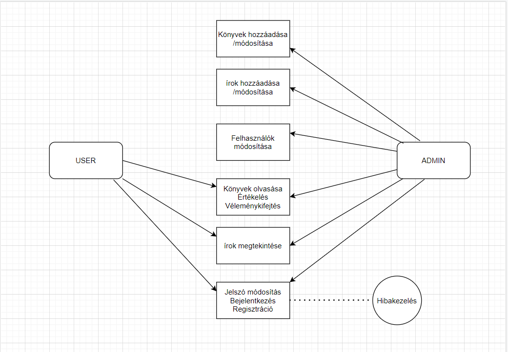
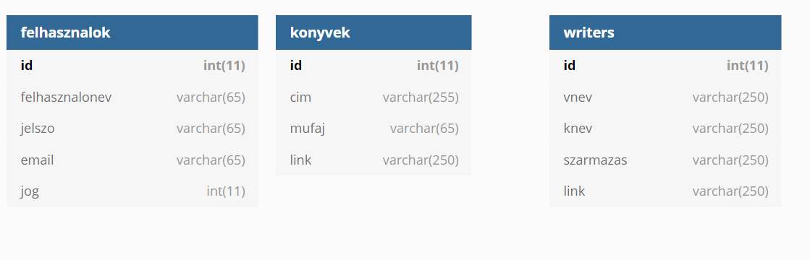

## 1. Rendszer célja

A rendszer célja, egy olyan weboldal kialakítása, ahol egy helyen tároljuk az interneten található online, pdf formátumú könyvek forrását, megkönnyítve ezek megtalálását.
Ezen felül lehetőséget bíztosít, a könyvek értékelésére, valamint vélemény kifejtési opciót biztosít amelyet megoszthatnak egymás között a felhasználók. Készül egy írók nevezetű menüpont is, ahol a felhasználók, megismerhetik az egyes könyvek szerzőjének élettörténetét is. Könyveket, valamint írókat az adatbázisba csak az admin felhasználó vehet fel. A regisztráció nélküli látogatók csak egy minimális betekintőt kapnak az oldalra látogatásukkor, hogy mihez férnek majd hozzá ha beregisztráltak.
Regisztráció után kapnak teljes hozzáférést az oldal funkcióihoz. A weboldal mindenki számára egyszerű, könnyen kezelhető felületet kap.

## 2. Projektterv

1. Projekttszerepkörök:
  * Termék tulajdonos: DevTrio (teljes csapat)
2. Projekttmunkások és felelősségek:
  * Backend munkálatok: Csapat tagjai
  * Frontend munkálatok: Csapat tagjai
Feladatuk: adatbázis létrehozása az adatok tárolásához, megfelelő funkciók elkészítése az oldal megfelelő működésének érdekében, felhasználói felület kialakítása.
1. Ütemterv:
  1. Követelmény specifikáció
  2. Funkcionális specifikáció
  3. Rendszerterv
  4. Adatbázis kialakítása
  5. Backend funkciók elkészítése
  6. Frontend design megtervezése
  7. Felhasználói felület kialakítása

## 3. Üzleti folyamatok modellje



## 4. Követelmények

  **Funkcionális követelmények**
  - **Felhasználók adatainak tárolása**
  - **Felhasználók tudják változtatni adataikat**
  - **Könyvek adatainak tárolása**
  - **Könyvekhez tartozó linkek tárolása**
  - **Reszponzív webes alapú megjelenítés**
  - **Adminisztrátor tudja szerkeszteni a könyvek adatlapjait és a hozzá tartozó linkeket**

  **Nem funkcionális követelmények**
  - **A felhasználók nem férnek hozzá egymás adataihoz**

  **Törvényi előírások, szabványok:**
  - **GDPR-nek való megfelelés**

## 5. Funkcionális terv

  **Rendszerszereplők:**
  - **Adminisztrátor**
  - **Felhasználó**
  - **Vendég**

  **Rendszerhasználati esetek és lefutásaik:**
  - **Adminisztrátor**
    - **Képes felhasználókat törölni**
    - **Tudja módosítani a felhasználók jelszavát és adatait is**
    - **Látja az összes regisztrált felhasználót**
    - **Módosítani tudja a könyveket, azok adatait és a hozzátartozó linkeket**
    - **Teljes hozzáférése van a rendszerhez**
  - **Felhasználó**
    - **Megtekintheti a könyveket, és lekérheti a hozzátartozó linkeket**
    - **Módosíthatja a saját adatait**
    - **Módosíthatja jelszavát**
  - **Vendég**
    - **Láthatja a könyveket, de a linkeket nem éri el.**
    - **Képes regisztrálni és bejelentkezni**

  - **Menü-hierarchiák:**
    - **Bejelentkezés**
    - **Regisztráció**
    - **Betekintő**

    - **Bejelentkezés után:**
      - **Felhasználók listája:** kizárólag admin joggal rendelkező felhasználóknak
      - **Könyvek listája:** kizárólag admin joggal rendelkező felhasználóknak
      - **Könyvek hozzáadása:** kizárólag admin joggal rendelkező felhasználóknak

      - **Könyvek**
      - **Szerzők**
      - **Kijelentkezés**


## 6. Fizikai környezet

  - **Az alkalmazás csak web platformra készül.**
  - **Nincsennek megvásárolt komponensek.**
  - **Fejlesztői eszközök:**
    - **Visual Studio Code**
    - **Notepad++**
    - **Sublime text 3**
    - **MySQL Workbench**
    - **HediSQL**

## 7. Architekturális terv

A rendszerhez szükség van egy adatbázis szerverre, ebben az esetben MySql-t használunk. A backend php alapú. A bootstrap, a CSS keretrendszer felel a reszponzív webdesign-ért.

## 7. Adatbázis terv
**Táblák**
- **felhasznalok:** Minden felhasználó, aki az oldalon regisztrált
  - **id:** Azonosító szám, mindenképp felvesz egy eglsz típusú értéket, amit a rendszer automatikusan generál és egyesével növekszik, nem lehet két azonos szám
  - **felhasznalonev:** A felhasználók bejelntkezési/felhasználói neve, nem lehet üres
  - **jelszo:** Nem lehet üres a mező
  - **email:** Egyedi, tehát nem lehet két felhasználónak ugyanazon email címe és egyben nem lehet üres mező
  - **jog:** Egész érték, nem lehet üres mező
- **konyvek:**
  - **id:** Minden könyv egyedi azanosítóval bír, automatikusan növekszik és nem lehet üres mező
  - **cim:** A könyv címe, nem lehet üres mező
  - **mufaj:** Az adott könyv műfaja, nem lehet üres mező
  - **link:** Link az adott könyvhöz, nem lehet üres mező
- **writers:**
  - **id:** Az adott író azonosítója, nem lehet üres és automatikusan növekszik
  - **vnev:** Az író vezetékneve, nem lehet üres mező
  - **knev:** Az író keresztneve, nem lehet üres mező
  - **szarmazas:** Az író származási helye, nem lehet üres mező
  - **link:** Nem lehet üres mező


**DSL**
```
Table "felhasznalok" {
  "id" int(11) [pk, not null, increment]
  "felhasznalonev" varchar(65) [not null]
  "jelszo" varchar(65) [not null]
  "email" varchar(65) [not null]
  "jog" int(11) [not null]

Indexes {
  email [unique, name: "email"]
}
}

Table "konyvek" {
  "id" int(11) [pk, not null, increment]
  "cim" varchar(255) [not null]
  "mufaj" varchar(65) [not null]
  "link" varchar(250) [not null]
}

Table "writers" {
  "id" int(11) [pk, not null, increment]
  "vnev" varchar(250) [not null]
  "knev" varchar(250) [not null]
  "szarmazas" varchar(250) [not null]
  "link" varchar(250) [not null]
}

```

**UML**



## 9. Implementációs terv

A webes felület HTML, CSS és PHP nyelven fog készülni. A különböző technológiákat amennyire lehet, külön fájlokba írva készítjük el, úgy csatoljuk egymáshoz. Így átláthatóbb, könnyebben változtatható és bővíthető lesz. Az adatokat egy MySql adatbázisban fogjuk tárolni. A reszponzív webdesign-t Bootstrap-pel fogjuk biztosítani.

## 10. Tesztterv

Az alább leírt tesztelések célja a rendszer és funkcióinak teljes körű vizsgálata, ellenőrzése.

Linkek, gombok tesztelése: a teszt célja a weboldalon megjelenő linkek és gombok megfelelő működésének ellenőrzése.
A weboldal és az adatbázis kapcsolatának vizsgálata: fel kell tudnia tölteni az adatbázist a megfelelő adatokkal és vissza kell tudnia adni azokat. Törlési, hozzáadási, módosítási műveletek tesztelése. A jelszavak megfelelő tárolásának ellenőrzése, vagyis minden jelszó titkosításának (hashelésének) ellenőrzése.
Hibás, hiányos adatok esetén adott hibaüzenetek ellenőrzése.
A weboldal helyes működésének ellenőrzése különböző böngészőkben pl. Firefox, Google Chrome…


## 11. Telepítési terv

A szoftver webes felületéhez csak egy böngésző telepítése szükséges.
* Windows - Google Chrome
* Linux - Mozilla
* Mac - Safari
A webszerverre közvetlenül az internetről kapcsolódnak rá a kliensek.
A böngésző címsorába csak az oldal címét kell beírni: xyz.com

## 12. Karbantartási terv

Az alkalmazás folyamatos üzemeltetése és karbantartása, mely
magában foglalja a programhibák elhárítását, a belső igények változása miatti
módosításokat, valamint a környezeti feltételek változása miatt
megfogalmazott program-, illetve állomány módosítási igényeket. Ellenőrizni kell, hogy egy adott böngészővel kompatibilis-e a webes felület. Idő elteltével újabb kategóriákkal, funkciókkal és tartalommal kell bővíteni az oldalt a felhasználói igények szerint.

* Corrective Maintenance: A felhasználók által felfedezett és "user reportban"
elküldött hibák kijavítása.
* Adaptive Maintenance: A program naprakészen tartása és finomhangolása.
* Perfective Maintenance: A szoftver hosszútávú használata érdekében végzett
módosítások, új funkciók, a szoftver teljesítményének és működési
megbízhatóságának javítása.
* Preventive Maintenance: Olyan problémák elhárítása, amelyek még nem
tűnnek fontosnak, de később komoly problémákat okozhatnak.